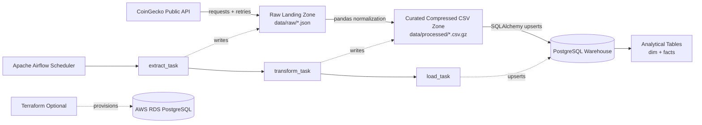

# CoinGecko Crypto ETL Pipeline

🌐 [View Live Project Showcase Website](http://localhost:8000/showcase-site/)

This repository demonstrates a production-style end-to-end data engineering workflow for a junior data engineer portfolio. It extracts cryptocurrency time-series data from the public CoinGecko API, lands raw JSON locally, transforms the payload into curated analytical datasets, upserts PostgreSQL warehouse tables, and schedules the workflow with Apache Airflow in Docker.

The companion showcase website in [showcase-site/index.html](showcase-site/index.html) is designed for hiring managers. It includes the captured Airflow Graph View, warehouse counts, architecture visuals, schema viewer, and verification commands.

## Verified Run Snapshot

| Signal | Result |
| --- | --- |
| Airflow DAG | `coingecko_market_pipeline` |
| Successful run ID | `showcase_capture_123456` |
| Task states | `extract_task`, `transform_task`, `load_task` all `success` |
| `dim_crypto_asset` rows | `1` |
| `fact_crypto_market_observation` rows | `721` |
| `fact_daily_crypto_market_metric` rows | `31` |
| Captured proof | [assets/screenshots/airflow_graph.png](assets/screenshots/airflow_graph.png) |

## Architecture



## Tech Stack

| Layer | Tooling | Purpose |
| --- | --- | --- |
| Source API | CoinGecko market chart API | Stable public cryptocurrency time-series source |
| Language | Python 3.11+ | Portable ETL implementation |
| Extraction | `requests`, `tenacity`, `python-dotenv` | API calls, retries, timeout handling, env config |
| Raw Storage | Timestamped JSON files | Landing zone and audit trail |
| Transformation | `pandas` | Cleaning, typing, aggregation, moving metrics |
| Curated Storage | Gzip-compressed CSV | Structured local analytical files without native build friction |
| Warehouse | PostgreSQL 16 | Relational analytical target |
| Loading | `SQLAlchemy`, `psycopg2`, PostgreSQL `ON CONFLICT` | Schema creation and idempotent upserts |
| Orchestration | Apache Airflow 2.10 in Docker Compose | Scheduling, dependency management, operational logs |
| Infrastructure | Docker Compose, optional Terraform AWS RDS scaffold | Local reproducibility and cloud promotion path |
| Quality Gates | `ruff`, `pytest` | Linting and warning-free tests |

## Repository Structure

```text
.
├── assets/screenshots/airflow_graph.png     # Captured successful Airflow Graph View
├── airflow/requirements.txt                 # Airflow container add-on dependencies
├── dags/coingecko_market_pipeline_dag.py    # Airflow DAG definition
├── data/                                    # Generated local data lake zones, ignored by Git
│   ├── raw/
│   └── processed/
├── showcase-site/index.html                 # Static portfolio showcase website
├── scripts/run_pipeline.sh                  # Repeatable local pipeline command
├── sql/ddl.sql                              # Warehouse DDL
├── src/etl/                                 # Extract, transform, load package
├── terraform/aws-rds-postgres/              # Optional AWS RDS PostgreSQL scaffold
├── IMPLEMENTATION_PLAN.md                   # Build checklist and verification plan
├── Makefile                                 # Local commands
├── docker-compose.yml                       # Airflow + PostgreSQL stack
├── pyproject.toml                           # Pytest and Ruff configuration
└── requirements.txt                         # Local Python dependencies
```

## Run ETL and Showcase Together

Start the data platform stack in Docker:

```bash
cp .env.example .env
make setup
make up
```

Run the ETL pipeline from the local virtual environment:

```bash
make run
```

Serve the portfolio website from the repository root:

```bash
make showcase
```

Open the following local URLs:

| Experience | URL |
| --- | --- |
| Showcase website | `http://localhost:8000/showcase-site/` |
| Airflow UI | `http://localhost:8080` |

Airflow credentials for local development:

| Username | Password |
| --- | --- |
| `airflow` | `airflow` |

## Warehouse Model

### `dim_crypto_asset`

| Column | Type | Key | Purpose |
| --- | --- | --- | --- |
| `asset_key` | `BIGSERIAL` | Primary key | Surrogate key for fact joins |
| `coin_id` | `TEXT` | Unique with `vs_currency` | CoinGecko asset identifier, such as `bitcoin` |
| `vs_currency` | `TEXT` | Unique with `coin_id` | Quote currency, such as `usd` |
| `created_at` | `TIMESTAMPTZ` |  | Dimension insert timestamp |
| `updated_at` | `TIMESTAMPTZ` |  | Last dimension update timestamp |

### `fact_crypto_market_observation`

| Column | Type | Key | Purpose |
| --- | --- | --- | --- |
| `asset_key` | `BIGINT` | Primary key, foreign key | Links observation to `dim_crypto_asset` |
| `observed_at` | `TIMESTAMPTZ` | Primary key | Source observation timestamp |
| `price_usd` | `NUMERIC(18, 8)` |  | Crypto asset price |
| `market_cap_usd` | `NUMERIC(24, 4)` |  | Market capitalization |
| `total_volume_usd` | `NUMERIC(24, 4)` |  | Trade volume |
| `loaded_at` | `TIMESTAMPTZ` |  | Warehouse load timestamp |

### `fact_daily_crypto_market_metric`

| Column | Type | Key | Purpose |
| --- | --- | --- | --- |
| `asset_key` | `BIGINT` | Primary key, foreign key | Links daily metric to `dim_crypto_asset` |
| `metric_date` | `DATE` | Primary key | Analytical daily grain |
| `avg_price_usd` | `NUMERIC(18, 8)` |  | Daily average price |
| `min_price_usd` | `NUMERIC(18, 8)` |  | Daily low price |
| `max_price_usd` | `NUMERIC(18, 8)` |  | Daily high price |
| `avg_market_cap_usd` | `NUMERIC(24, 4)` |  | Daily average market cap |
| `total_volume_usd` | `NUMERIC(24, 4)` |  | Daily total volume |
| `price_7d_moving_avg_usd` | `NUMERIC(18, 8)` |  | Seven-day moving average |
| `loaded_at` | `TIMESTAMPTZ` |  | Warehouse load timestamp |

## Why The Pipeline Is Split Into Stages

### Repo Setup

Production data teams isolate code, dependencies, generated files, and credentials from the start. This repository keeps `.env` out of Git, pins local dependencies, separates Airflow container requirements, and ignores generated data zones.

Risk of skipping this step: secrets can leak, generated data can pollute source control, and reviewers may not be able to reproduce the pipeline.

### Extraction

The extractor calls CoinGecko through `requests`, retries transient failures with `tenacity`, handles HTTP status codes and timeouts, and writes timestamped raw JSON.

Risk of skipping this step: raw source evidence disappears, API outages become hard to debug, and backfills require re-calling the external API.

### Transformation

The transformer uses `pandas` to normalize CoinGecko arrays, enforce UTC timestamps and numeric types, standardize snake_case columns, and create daily analytical metrics.

Risk of skipping this step: raw API payloads are not analysis-ready, date and numeric values can be misinterpreted, and metric definitions become scattered across consumers.

### Loading

The loader applies explicit DDL and uses PostgreSQL upserts, so repeated runs update existing facts instead of duplicating rows.

Risk of skipping this step: append-only loads can inflate metrics, dashboards can break on schema drift, and the warehouse contract becomes unclear.

### Orchestration

Airflow schedules and observes the workflow as `extract_task -> transform_task -> load_task`. Each phase has a separate task state and log trail.

Risk of skipping this step: failures become opaque, manual runs are hard to audit, and recovery requires rerunning more work than necessary.

## Production Best Practices Demonstrated

| Concern | Implementation |
| --- | --- |
| Credential isolation | `.env` is ignored and `.env.example` documents required variables |
| Data lineage | Raw JSON, curated CSV, and warehouse facts are separate stages |
| Idempotency | Fact tables use primary keys and PostgreSQL upserts |
| Schema governance | Warehouse DDL is versionable in [sql/ddl.sql](sql/ddl.sql) |
| Schema drift readiness | Extract and transform code validate expected source arrays and columns |
| Operational visibility | Airflow Graph View and task logs expose phase-level status |
| Cloud promotion | Terraform scaffold shows how PostgreSQL can move to AWS RDS |

## Verification Commands

```bash
source .venv/bin/activate
python -m src.etl.pipeline
ruff check src tests dags
pytest -q -W error
docker compose config --quiet
```

Check warehouse counts:

```bash
docker compose exec -T postgres psql -U warehouse_user -d crypto_warehouse -c "select count(*) as dim_assets from dim_crypto_asset;"
docker compose exec -T postgres psql -U warehouse_user -d crypto_warehouse -c "select count(*) as observations from fact_crypto_market_observation;"
docker compose exec -T postgres psql -U warehouse_user -d crypto_warehouse -c "select count(*) as daily_metrics from fact_daily_crypto_market_metric;"
```

Expected verified counts from the local run:

| Query | Expected count |
| --- | ---: |
| `dim_crypto_asset` | `1` |
| `fact_crypto_market_observation` | `721` |
| `fact_daily_crypto_market_metric` | `31` |

## Notes For Publishing

The static showcase site is intentionally framework-free and can be published through GitHub Pages, Netlify, Vercel static hosting, or any object storage website hosting. After publishing, update the top showcase link and the website GitHub button to the final public repository URL if it differs from the local portfolio path.
